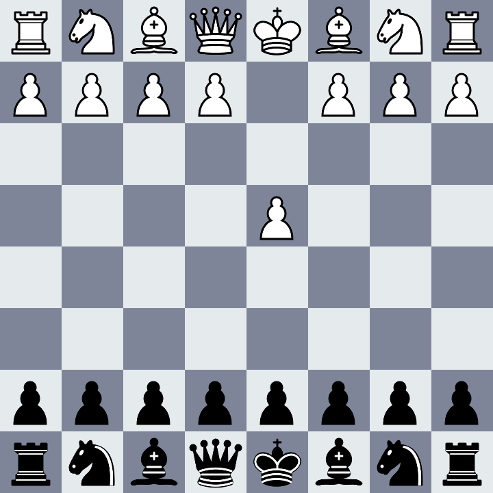

# Chess

A simple chess game made with glfw and opengl. Uses stbi to load images. Some chess rules haven't yet been implemented.



## Installing and running

1. Installing dependencies with vcpkg

Install glfw3, glad and stb
```
vcpkg install glfw3:x64-windows-static glad:x64-windows stb:x64-windows
```

2. Generating project
```
premake5.exe vs2022
```

3. Open generated project in visual studio. Build and run.
