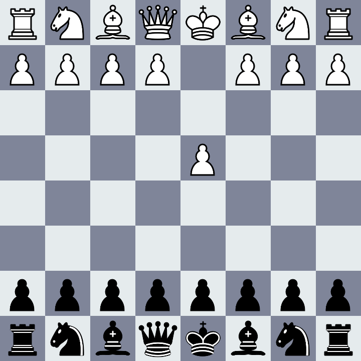

# Chess

A simple chess game made with glfw and opengl. Uses stbi to load images. 



## Build and run

### Visual studio

```
cmake -B build
cd build
start chess.slnx
```
Then build and run from visual studio.

